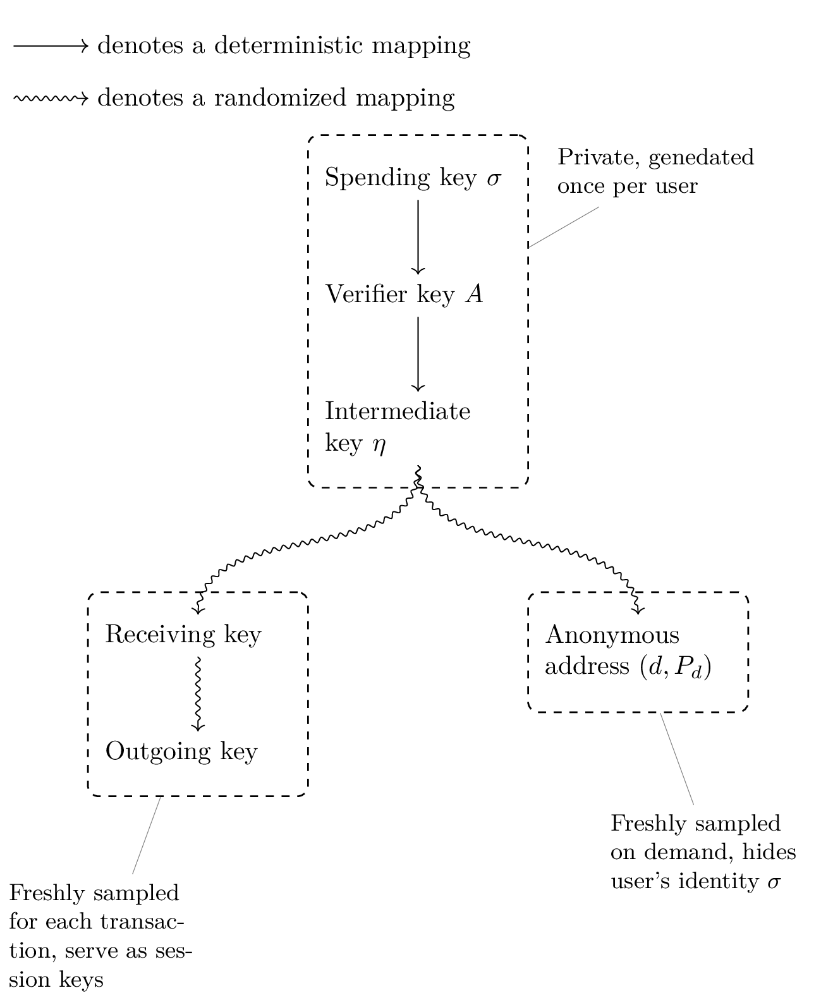
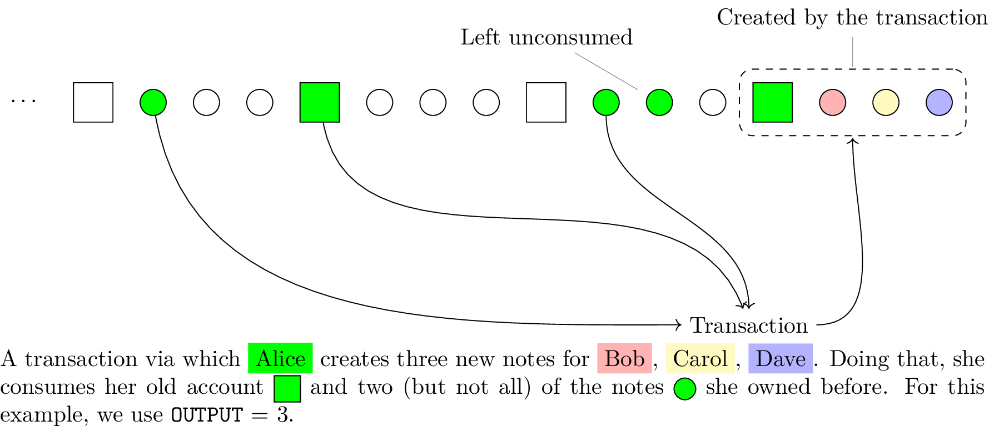
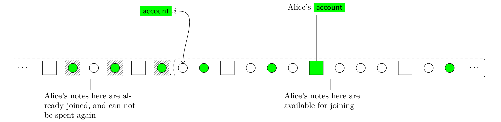

# Transaction Overview

On this page we overview different pieces of data that are involved in a
transaction, and the invariant conditions on that data that the transactions
maintain.

As mentioned in [Overview](overview), ZeroPool encodes all possible actions a
user may want to perform on the pool with a single transaction type. A ZeroPool
transaction consumes one account (associated with user's spending key $\sigma$)
and `INPUT` number of notes that belong to this account. In their place, it
creates a new account (associated with the same spending key $\sigma$ as the
old one) and `OUTPUT` number of new notes. The created new notes may belong to
accounts of other users (with keys different from $\sigma$). Consumed account
and notes can not be used again.

:::tip

Since the consumed and newly created account have the same associated
key $\sigma$ and belong to the same user, one can also view them as two
instantiations of the same account, and transaction as modifying this account:
creating a copy with some fields modified, invalidating the old version and
marking the new one as current.

:::

## Keys

The spending key $\sigma$ is the main key that controls the account and from
which all the other keys — private and public — are derived. The following
diagram shows the keys ZeroPool uses and the dependencies between them. We
use straight arrows for deterministic mappings (which always produce the same
value) and snake-shaped arrows for randomized mappings (that can be run with
the same input many times and produce different random output each time).

 - Spending key $\sigma$ is used to sign each transaction, which is then
   verified using verifier key $A$.

   The $\sigma$ is necessary for spending ZeroPool tokens. It's supposed to
   never leave user's device, and is only used to sign transactions locally.

 - Intermediate key $\eta$ identifies user's account in a transaction. User
   uses $\eta$ to create transactions, and later to prove the transaction
   correctness using a zkSNARK proof. In zkSNARK, $\eta$ is treated as a secret
   input so proof of transaction's correctness does not reveal $\eta$.

   Compromising $\eta$ will deanonymize the user, but won't allow the tokens to
   be stolen (assuming that $\sigma$ is not compromised).

 - The diversified address $(d, P_d)$ is used as anonymous address that a user
   gives to others in order to receive tokens (through notes) from them. It
   does not reveal the user's $\eta$, but allows the user who presents the
   correct $\eta$ to claim the tokens sent to this diversified address.

   A user can generate as many diversified addresses as she wants from the
   same $\eta$. If two different senders send tokens to the same diversified
   address, they won't learn anything about each other's transations.

 - The receiving and outgoing keys are picked fresh for each transaction and
   used by the receivers of notes to decrypt notes posted on some public medium
   (**TODO: Which one? More specificity.**).

## Sequence of Accounts and Notes

ZeroPool organizes all accounts and notes in a long, evergrowing sequence. Each
new transaction appends one account and `OUTPUT` notes to this sequence. We
only append values to the sequence via transactions, and never delete or modify
values that were added before.

Since every transaction creates exactly one account and `OUTPUT` notes, the
sequence will contain them exactly in this order: each $(\texttt{OUTPUT}+1)$-th
element is an account, and everything in-between is notes.

Consider the illustration above. Accounts are drawn as boxes and notes as
circles. We chose `OUTPUT` = 3 here (in practice `OUTPUT` will be much larger),
and the white accounts and notes belong to unspecified users (different from
Alice).

It shows how the sequence of accounts and notes changes when a transaction
happens. In this example, user Alice transfers some tokens to three other
users. Doing so, she consumers her (always unique, identified by her spending
key $\sigma$) account (first green box) and some notes (green circles), and
transfers the tokens held by these to her new account (the second green box)
and three new notes which will belong to the recepient accounts.

The ordering of notes that Alice's transation consumes with respect to her
account is not important, i.e. the consumed notes can be located both to the
left or to the right of the account in the sequence. But with respect to each
other, the notes are always consumed in the order in which they appear in the
sequence. If you own notes X, Y, Z that go in this order and you decide to
consume only X and Z, ZeroPool will treat Y as consumed too and forever lock
the tokens it's holding. Alice's account associated with her spending key
$\sigma$ is unique, so there's only one account that can serve as input to the
transaction that Alice performs.

:::info

Since the ordering between accounts and notes is not important for the
transaction, logically, it may be convenient to see this sequence as two
separate sequences merged together, one for accounts and one for notes.

:::

### Account Structure

An Account in ZeroPool is described by four fields:

1. Intermediate key $\eta$ of the account's owner.
2. Spent offset $i$.
3. Balance $b$, the amount of tokens that the account holds.
4. Random salt $t$.

The $\eta$ here binds the account to is owner. Balance $b$ tells how many
tokens the note is holding. And random salt $t$ is there just to make sure
that hash of the account doesn't reveal anything about the fields.

The field $i$ is pointing at some position in the sequence of accounts and
notes. All the notes belonging to this account that are located to the left
of $i$ are considered joined (spent), and the ones in position $i$ and to the
right of it are available for joining.

The picture above illustrates the meaning of spent offset. White accounts
and notes here stand for ones that belong to users other than Alice.

When Alice performs a transaction joining some notes, she will change the
spent offser of her account from old value $i$ to new $i'$. And during that
transaction, she can join the notes that are located between indices $i$ and
$i'$ in the sequence (thus maintaining the invariant). The current position of
Alice's account has no effect on the notes that she can join with that account,
i.e. the joined notes can go either before of after the account (green box on
the picture).

### Note Structure

A Note in ZeroPool is described by the following three fields:

1. $(d, P_d)$, diversified public address this note belongs to.
2. Balance $b$.
3. Random salt $t$.

Balance $b$ and salt $t$ here have the same meaning as in account.

The diversified public address $(d, P_d)$ is binding a note to the account it's
owned by. The values $d$ and $P_d$ are derived from $\eta$, but don't reveal
$\eta$ itself. In order to join a note, the user must know the value $\eta$ and
the account (belonging to $\eta$) to join the note with.

:::info

Accounts and notes where all fields are filled with zero values are called “blank”
  and have special meaning in ZeroPool.

- Blank account is used to create new accounts:
    it has $0$ balance,
    no notes can be associated with it,
    it has no concrete spending key
    but instead can be spent multiple times with any spending key $\sigma$.
  If you want to create a new account,
    you "spend" the blank account with your freshly sampled key $\sigma$,
    and after that you can start using your new account in future transactions.

- Blank note means "do not use this note".
  Since the number of `INPUT` and `OUTPUT` notes transaction works on is fixed
    (to keep the number of actually used notes private),
    we need a way to encode dummy notes that are not to be used
    if the user wants to use less of them.
  Blank notes that have all fields set to zero do just that.

:::

### Nullifiers

Nullifiers are special hash values that are computed based on account's data
  and its corresponding intermediate key $\eta$.
An account's nullifier uniquely identifies the account
  — yet it doesn't reveal the data of that account or its key.

More concretely, an account's nullifier is a hash of the account structure (all the fields in it),
  account's index in the sequence,
  and the intermediate key $\eta$ that the transaction is being invoked with,

$$
\textsf{nullifier} = H(\textsf{account}, \textsf{index}, \eta).
$$

When submitting a transaction, the user publishes the nullifier of the account
  that serves as input to this transaction.
The ZeroPool smart-contract keeps the global (public) history of all nullifiers it had seen,
  and rejects the transaction if its corresponding nullifier was already recorded.
This way, we make sure that no account can serve as input to a transaction more than once.

Each account in the sequence has a unique index,
  its concrete field values and only one intermediate key $\eta$ that it can be spent with.
Therefore, each account will have only one unique nullifier
  and won't be spent more than once.
One exception to this is the special blank account.
All of its fields are zero as well as its index,
  but each time it's being passed as input to a transaction,
  it's allowed to be spent with a new intermediate key $\eta$.
Each such call to "spend" blank account will have a different nullifier
  due to different intermediate keys $\eta$ being used.
This way, zero account can be spent by any intermediate key,
  but no more than once with each key.

Nullifier prevents double spending of accounts,
  and ensures that there exists at most one unique account associated with each intermediate key $\eta$.
In the meantime, account's spent offset $i$ ensures that no note can be spent twice
  — spending the note will move the spent offset of the account it belongs to,
  to the right of the note forever marking it as spent.

:::tip

An account does not have to be "created" in order to receive notes from
others. A user can simply generate keys $\sigma$, $\eta$, $(d, P_d)$ as usual
(no interaction with blockchain needed for this), give diversified public
address $(d, P_d)$ to a friend, and have the friend create notes on this
address. Notes will be stored in the sequence even though there's no record of
the account they belong to.

Later, the user can create an account with $\sigma$ as usual, initialize its
spent offset $i$ to 0 And start joining notes which his friend has sent him.

:::

## Merkle Tree Commitment

ZeroPool smart-contract does not store the whole sequence of nodes and
accounts, but instead only holds the (publicly known) commitment to it. We
use Merkle Tree to commit to the whole sequence of accounts and notes, and
incrementally append values to it.

Consider a Merkle Tree of height $h$. To store the sequence $s_0, s_1 \dots
s_{n-1}$ of accounts and notes in it, we assign first (going from left to
right) $n$ leaves of the tree hashes $H(s_0), H(s_1) \dots H(s_{n-1})$ and
fill the remaining $2^h - n$ leaves with zeroes. We compute the values of all
inner nodes according to the usual Merkle Tree rule. (If no transactions have
happened yet and the sequence is empty, all leaves of the Merkle Tree will be
initialized with zeroes.)

This way, for any sequence element $s_k$, its index $k$ can be naturally
interpreted as the path to the leaf where $H(s_k)$ is stored: decompose number
$k$ into $h$ bits and treat $0$s and $1$s in it as a sequence of "left" and
"right" turns leading from the tree root to a leaf. One can also efficiently
recompute the Merkle Tree if some leaf is modified, or even multiple leaves in
bulk by updating a subtree. We've covered this in [Background](background).

Even though Merkle Tree allows modifying any leaf (including the ones we've
assigned before), we only use this functionality to append values to the
sequence and never modify elements that were added to it before. Say, if the
Merkle Tree leaves currently currently have values

$$
H(s_0), H(s_1) \dots H(s_{n-1}), 0, 0 \dots 0
$$

assigned to them, the only modification we will do is overwriting the $0$ in
leaf $n$ with value $H(s_{n})$.

Using Merkle Tree commitment to implement a sequence of accounts and notes in
ZeroPool means that the total length of the sequence can never exceed $2^h$.

## Putting Everything Together

Here's the breakdown of who holds each piece of data described above:

 - The ZeroPool smart-contract knows:

   1. The `root` of the Merkle tree that commits to the current sequence of
      accounts and notes.
   2. The set of nullifiers published by transactions so far.

   Since the operations performed by the smart-contract are public as well as
   the data they operate on, these values are also visible to all users.

 - Each ZeroPool user knows:

   1. His spending $\sigma$, verifying $A$, intermediate $\eta$ keys.
   2. His account: its index in the sequence and all the fields ($i, b, t$).
   3. The contents of all the notes that were sent to him by other users.

### zkSNARK Constraint system

In order to check that transactions proposed by users are valid, and avoid
disclosing the transaction details (accounts invonved, amounts of tokens
transferred) we use zkSNARKs. In this section, we define the zkSNARK constraint
system used.

#### Public Inputs

1. `old_root`, the current Merkle tree root that serves at the commitment of
   the accounts and notes sequence state before the transaction.
2. `new_root`, the proposed root of the Merkle tree after the transaction.
3. `nullifier`, the nullifier of transaction's input account (the one that's
   being "spent" or consumed by the transaction).
4. `delta`, the difference between the amount of tokens the transaction
   produces and the amount it consumes (`delta` being a nonzero value means
   that this transaction either involves a deposit into ZeroPool from an
   account on the underlying blockchain or a withdrawal).

#### Secret Inputs

1. User's verifying $A$ and intermediate $\eta$ keys.

1. Transaction:

   1. The values of input account and notes, $\textsf{in\_account}$ and $\textsf{in\_notes}[\textsf{INPUT}]$.
   1. Merkle proofs pointing at the hashes of input accounts
        and notes in the sequence bound by `old_root` committment.
   1. The values of the output account and notes, $\textsf{out\_account}$ and $\textsf{out\_notes}[\textsf{OUTPUT}]$.
   1. Index of the left-most zero leaf in the Merkle tree
        (the position from which the output account and notes will be written to the sequence).

1. The signature of the transaction above produced using user's spending key $\sigma$.

:::info

Note that the spending key $\sigma$ which is necessary to create transactions
  is not part of (public or secret) inputs to zkSNARK constraint system.
This means that $\sigma$ can be stored on a separate hardware ledger (capable of signing)
  providing an extra level of security in case the device that computes zkSNARK proofs is compromised.

:::

#### Conditions Checked

1. Input notes are unique or blank (all fields equal zero).
   Output notes are unique or blank.

1. Keys:

   - Transaction's signature is correct (checked using verifying key $A$).
   - The intermediate key $\eta$ is the one derived from $A$,
       (the mapping $A \mapsto \eta$ is deterministic).
   - The $\eta$ is owner of input and output accounts —
  	   checked using $\textsf{account}.\eta$ field.
   - The $\eta$ is the owner of input notes (but not necessary owner of output notes).
     This is checked by looking at note's diversified address $(d, P_d)$
       and checking that it's associated with $\eta$.

1. The public nullifier for input account is computed correctly.

1. Inputs Merkle proofs:

     - The input account is either blank
         (meaning that it's being created for the first time)
         or has a valid Merkle proof showing that it's present in the sequence.

     - The input notes are either blank (unused) or have valid Merkle proofs.

1. Spent note index only moves forward, $\textsf{in\_account}.i \leq \textsf{out\_account}.i$.

1. The positions of all non-blank input notes in the sequence (proven by Merkle proofs above)
     must be between $\textsf{in\_account}.i$ and $\textsf{out\_account}.i$.

1. Difference between input (account and notes) balances
     and output (account and notes) balances should be equal to `delta`.

The current ZeroPool implementation splits the conditions above into two separate sets of zkSNARK constraints
  called “tree circuit” and “transaction circuit”.
This is done for performance reasons,
  but the result is the same as checking all the conditions in one circuit.

### Steps to Verify a Transaction

ZeroPool smart-contract maintans an internal state consisting of two components:

- `root`, root of the Merkle tree containing the current sequence of accounts and notes,
- `nullifiers`, history all nullifiers that were published in the past,
- `snark_vk`, verifying key for zkSNARK proofs (initialized when ZeroPool smart-contract is deployed and never modified).

:::note

Since the whole set of nullifiers can get quite large,
  in practice one may store only Merkle commitment to the set
  and have the transaction caller prove that certain nullifier is or isn't in the set.
This way, whole state maintained by the contract will consist only of two Merkle commitments.

To simplify the exposition,
  we will treat nullifiers as a list of values and have contract manipulate it directly in this section.

:::

ZeroPool expects the following parameters to each transaction it receives.
Note that since all computation steps of a smart-contract are public,
  these values are publicly visible.

- `new_root`
- `nullifier`
- `snark_proof`
- `delta`
- `withdrawal_address`

A transaction peforms the following:

1. Check that `nullifier` is not present in saved `nullifiers` state.

1. Retrieve `old_root` saved in the smart-contract state, and verify the `snark_proof` with
     - `snark_vk` as verifying key,
     - `(delta, nullifier, old_root, new_root)` as public inputs.

1. Handle net balance change:

     - If $\textsf{delta} < 0$,
         ensure that the transaction has deposited `delta` tokens to ZeroPool smart-contracts's account
         (on the underlying blockchain).

     - If $\textsf{delta} > 0$ and all the checks above passed,
         send `delta` amount of tokens to address `withdrawal_address`.

1. If no error occured in the steps above,
     save `new_root` as the root and append `nullifier` to the `nullifiers`
     in the new state.

<!---
### Steps to Create a Transaction
-->
