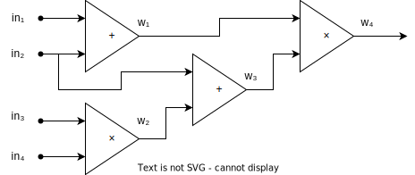

# Background

## zkSNARKs

Zero-Knowledge Succinct Non-Interactive Argument of Knowledge (zkSNARK) is
a cryptographic primitive that allows one party called Prover to convince
another party called Verifier that Prover knows a secret value satisflying
some property. Moreover, it does so by sending only one message from Prover to
Verifier (Non-Interactive) and keeping Prover's the secret value private from
Verifier (Zero-Knowledge).

Let $C(\texttt{sec}, \texttt{pub}) \in \{0, 1\}$ be a predicate that expresses
the property of the Prover's secret value $\texttt{sec}$ that the parties want
to verify. The $\texttt{pub}$ here is a *public parameter* that's known to
both Prover and Verifier — it is also called *instance*. The $\texttt{sec}$
is a *secret parameter* known only to the Verifier — another term for it is
*witness*.

As an idealized example, consider a zkSNARK being implemented via algorithms
$\texttt{prove}$ and $\texttt{verify}$ that is used as follows.

 - Prover and Verifier both agree on the public value $\texttt{pub}$ they will
 use.

 - Prover runs $\texttt{proof} \gets \texttt{prove}(C, \texttt{pub},
 \texttt{sec})$, sends $\texttt{proof}$ to Verifier.

 - Verifier runs $\texttt{result} \gets \texttt{verify}(C, \texttt{pub},
 \texttt{proof})$.

zkSNARK guarrantees that $\texttt{result} = 1$ if and only if $C(\texttt{pub},
\texttt{sec}) = 1$. Otherwise, Verifier will see that $\texttt{result} = 0$ and
know that Prover's witness $\texttt{sec}$ is incorrect. The $\texttt{proof}$
value does not reveal anything about Prover's secret $\texttt{sec}$, and is
guarranteed to be short (succinct) — much smaller than the amount of operations
that $C$ performs. Usually the $\texttt{proof}$ is also very easy to verify,
even easier than computing the predicate $C$.

:::info

In reality, the $\texttt{prove}$ and $\texttt{verify}$ take more parameters
that carry setup data (which may depend on the predicate $C$ or not). We omit
the setup parameters in this section for simplicity, but we will come back to
them when we look at concrete code examples for proving and verifying proofs.

:::

:::tip

The definition of zkSNARK we presented above requires the computation $C$ that
is being verified to be a predicate, but this definition is robust enough to
verify the evaluation of functions that output more than just one bit. Suppose
that Prover wants to convince Verifier that he knows $\texttt{sec}$ such
that $F(\texttt{pub}, \texttt{sec}) = y$ where function $F$, parameter
$\texttt{pub}$ and output value $y$ are public. He could construct predicate
(the $=^?$ denotes testing values for equality, like `==` operator in
C/C++/Rust)

$$
  C((\texttt{pub}, y), \texttt{sec}) := (F(\texttt{pub}, \texttt{sec}) =^? y)
$$

which equals $1$ if
and only if $F(\texttt{pub}, \texttt{sec}) = y$. Then send $y$ together with

$$
  \texttt{proof} \gets \texttt{prove}(C, (\texttt{pub}, y), \texttt{sec})
$$

to the Verifier who can check that the $y$ is indeed the correct output of $F$
by doing $\texttt{verify}(C, (\texttt{pub}, y), \texttt{proof})$.

:::

What makes zkSNARKs useful for Blockchain? Whole state of the Blockchain
is public, and each update to made to it is completely transparent for any
participant to inspect. At the same time, the computations that implement
such updates (e.g. in a smart contract) are very expensive since they have
to be replicated by every node on the network. zkSNARKs can help move such
computations off-chain, where they are performed cheaper and can access some
private data without disclosing it to the Blockchain, and then give Blockchain
a $\texttt{proof}$ certifying their correctness. In addition to enabling
public-state Blockchain to work with secret data, zkSNARKs can reduce the
Blockchain's computational burden and move the bulk of the computational work
off-chain where it's cheaper.

## Constraint Systems & Circuits

zkSNARKs often represent $C$ as a system of equations where $(\texttt{pub},
\texttt{sec})$ values that satisfy the predicate are also solutions
(each $\texttt{pub}$ and $\texttt{sec}$ storing a vector of variables)
to the equation system. Such equation system is called Constraint
System (CS). Algorithms $\texttt{prove}$ and $\texttt{verify}$, for
example, accept $C$ encoded as a Constraint System of some specific
form (each concrete zkSNARK having its own form).

Constraint Systems are also called "circuits" in zkSNARK jargon (we will use
the two terms interchangably here), because it's often very convenient to view
the computations that a Constraint System is expressing as evaluation of a
[circuit](https://en.wikipedia.org/wiki/Circuit_(computer_science)). A circuit
has gates and wires connecting them. Each wire has a value associated with it,
and each gate transforms the values on its input wires into the value of its
output wire.

:::tip

The standard way to translate a circuit into its corresponding CS is to assign
a CS variable to each of the circuit's wires and then add a CS constraint for
each of the circuit gates ensuring that the inputs and outputs are related
according to the function the gate is computing. The way a gate is incoded in
CS will be dependent on the zkSNARK you use.

As an example, consider the circuit below.

Converting it to a CS will yield the following constraints:

$$
 \begin{aligned}
   w_1 &= \texttt{in}_1 + \texttt{in}_2 \\
   w_2 &= \texttt{in}_3 \times \texttt{in}_4 \\
   w_3 &= \texttt{in}_2 \times w_2 \\
   w_4 &= w_1 \times w_3 \\
 \end{aligned}
$$

The $\texttt{in}$ and $w$ in these expressions are variables the values of
which can be assigned by $\texttt{pub}$ or $\texttt{sec}$.

:::

Circuits are a convenient model that allows one to express nested functional
dependencies between the variables of a CS. Once you've produced such
constraints using a circuit, you can add any other constraints (supported by
your zkSNARK) that you like to the CS as well.

To summarize, constraint systems are the "true" low-level format to which our
circuit description will be translated before use with a zkSNARK. But most
of the time when we program Constraint Systems we like to think of them as
circuits computing functions, and then applying some extra constraints to
the results of those functions. For this reason, the API of fawkes-crypto is
tailored to describe constraints in circuit format, but we also allow adding
"raw" constraints to the CS directly, bypassing the circuit representation.

## Programming a Constraint System

In order to use a zkSNARK in a practical protocol, Prover and Verifier
must agree on the CS $C$ they're proving. The moment when $C$ is passed to
$\texttt{prove}$ or $\texttt{verify}$ it will be represented by a list of
equations of some specific format. But before that, a programmer needs to
implement it and verify that it does what Prover and Verifier intend it
to. Given how complex the $C$ can get in practical applications, a list of
equations is not a convenient format to do that.

We need some language to describe the logic of Constraint System $C$ in a
way that is expressive and easy to understand. Fawkes-crypto provides Rust
API to do just that. We allow creating a circuit description that can be
used by both Prover and Verifier, and which also aids Prover in computing
$C$ (like in our example above when Prover needed to determine the $y =
F(\texttt{pub}, \texttt{sec})$). By using one circuit description for all
these tasks, we reduce boilerplate and help implement a zkSNARK application
correctly.

:::info

What fawkes-crypto provides is called Embedded Domain Specific
Language (EDSL) as opposed to regular DSLs for zkSNARKs like
[Circom](https://github.com/iden3/circom), because it is embedded as an API
in it host language, Rust. This allows for seamless integration between the
target Rust app that's using a zkSNARK and the circuit implementation.

:::

Another benefit of an abstract EDSL for describing circuits is that one can use
the same circuit description written in Fawkes-crypto with multiple different
zkSNARK backends. This enables flexibility and rapid prototyping of zkSNARK
applications, albeit at the cost of not having your circuit description
precisely tailored for the specific zkSNARK you may have chosen.
